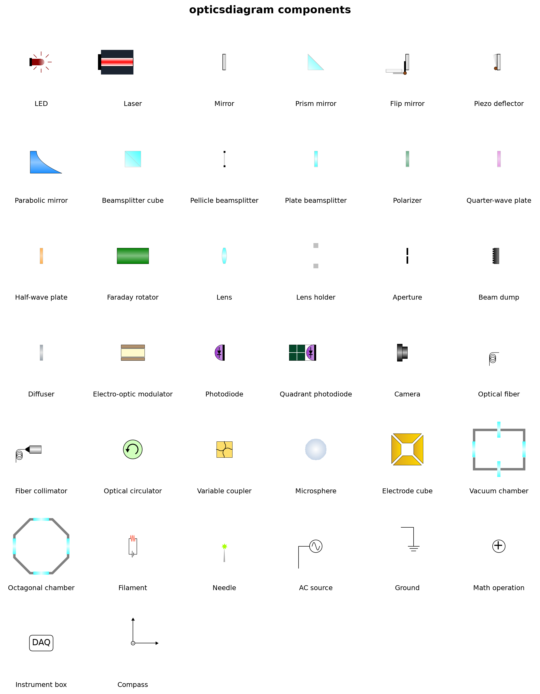
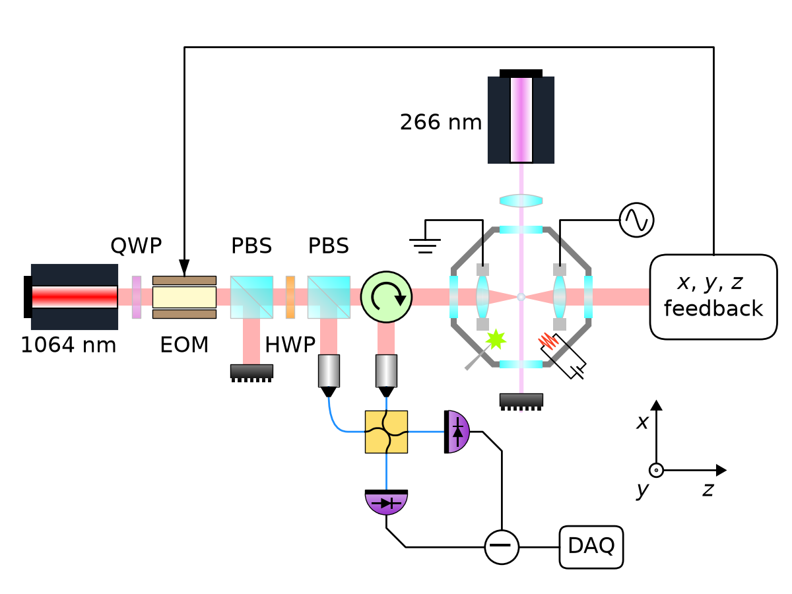
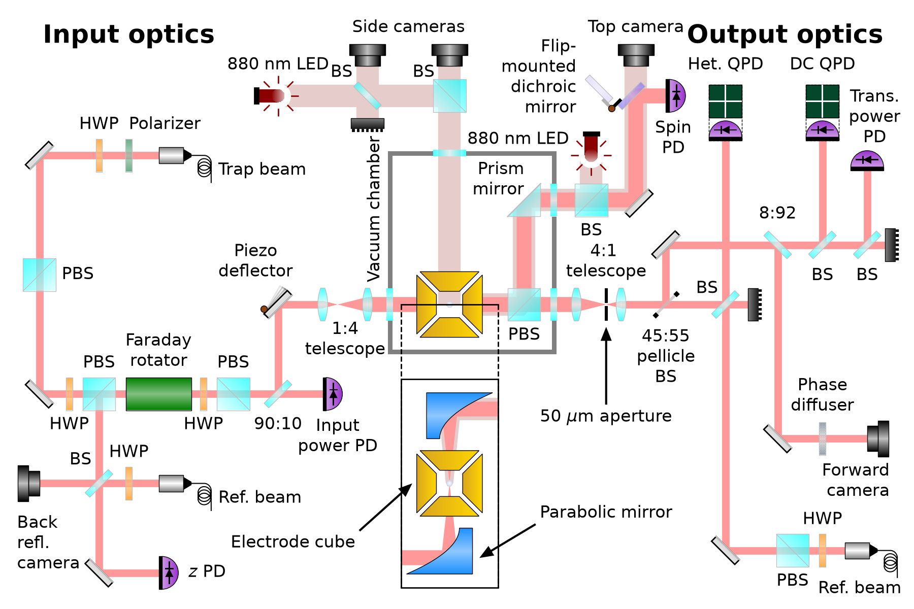

# opticsdiagram

Publication-quality optics layout diagrams with [matplotlib](https://matplotlib.org/).

`opticsdiagram` provides a single drawing canvas, `OpticsDiagram`, with one method per
optical element — mirrors, lenses, beamsplitters, wave plates, photodiodes, vacuum
chambers, and more. You build a layout by placing elements at chosen coordinates and
connecting them with beams and wires. Everything is drawn in shared data coordinates, so
positioning a setup is just simple arithmetic on a grid.



## Installation

Install the latest version directly from GitHub:

```bash
pip install git+https://github.com/clarkehardy/optics-diagram.git
```

Or clone and install in editable mode for development:

```bash
git clone https://github.com/clarkehardy/optics-diagram.git
cd optics-diagram
pip install -e .
```

The only dependencies are `numpy` and `matplotlib`.

## Quickstart

```python
from opticsdiagram import OpticsDiagram

# A canvas 4 x 3 inches; one data unit = one inch.
od = OpticsDiagram(figsize=(4, 3), component_size=0.22, fontsize=8)

od.laser(0.6, 1.5)
od.annotation(0.6, 1.2, "1064 nm", ha="center", va="top")

od.waveplate(1.4, 1.5)
od.cube_bs(2.0, 1.5)
od.lens(2.6, 1.5)
od.photodiode(3.3, 1.5)

od.laser_beam([(0.6, 1.5), (3.3, 1.5)])

od.savefig("layout.pdf")
```

Every placeable element is a method called as `od.<element>(x, y, angle=...)`. Elements
draw themselves onto the canvas and return nothing — you place one where you want it
(optionally tweaking the position or angle) and move on.

### How positions and sizes work

- **You choose the figure size.** `figsize=(width, height)` sets the canvas size in
  inches. The drawing area spans `[0, width] x [0, height]`, so **one data unit is one
  inch** and every coordinate is measured in inches from the **bottom-left corner**.
- **`component_size` is the base size of a component, in inches.** Every element is
  scaled as a fixed multiple of it, so it sets the overall scale of the diagram.
- **Place each element at an `(x, y)` position** in inches from the bottom-left corner.
  Beam paths, wire paths, and annotation positions all use these same coordinates.

### Rotating and mirroring components

Most elements take an `angle` (in degrees, counter-clockwise positive) that rotates them
about their `(x, y)` position. Components that produce or interact with a beam are drawn,
at `angle = 0`, for a beam travelling **horizontally to the right** — so a left-to-right
beam needs no rotation, and you rotate detectors, lenses, mirrors, sources, etc. only to
send the beam in another direction.

Some components are not left–right symmetric and can additionally be flipped with
`reflected=True` to swap their handedness — for example `flip_mirror`, `piezo_deflector`,
`parabolic_mirror`, `circulator`, and the fiber pigtail on `collimator` / `fiber`.

## Available components

The image at the top of this README is generated from the live component registry by
[`scripts/make_component_grid.py`](scripts/make_component_grid.py) — every element in the
package appears there with its name. To regenerate it:

```bash
python scripts/make_component_grid.py
```

You can also enumerate the components programmatically:

```python
from opticsdiagram import COMPONENT_REGISTRY
for key, meta in COMPONENT_REGISTRY.items():
    print(meta["category"], "—", meta["display_name"])
```

In addition to the placeable components, the canvas provides drawing tools that are not
single elements: `laser_beam` and `focused_beam` (beam paths), `wire` (cables, with
optional rounded corners and arrowheads), `annotation` (labels with optional arrows),
`section_view` (cut-away boxes), and helpers such as `rotate`, `apply_gradient`, and
`data_to_points`.

## Examples

Full, runnable diagrams from real experiments live in [`examples/`](examples/). Each
script writes its figure to `examples/output/`.

### Levitated-nanosphere setup

[`examples/nanosphere_setup.py`](examples/nanosphere_setup.py) — a levitated-nanosphere
trapping and readout layout.



### Microsphere setup

[`examples/microsphere_setup.py`](examples/microsphere_setup.py) — a detailed microsphere
interferometric readout layout with input/output optics, a vacuum chamber, and a section
view.



## Acknowledgements

The visual design of many of the components was inspired by the excellent
[gwoptics Component Library](http://www.gwoptics.org/ComponentLibrary/), a set of
optical-layout drawing primitives from the gravitational-wave optics group.

## License

Released under the [MIT License](LICENSE).
